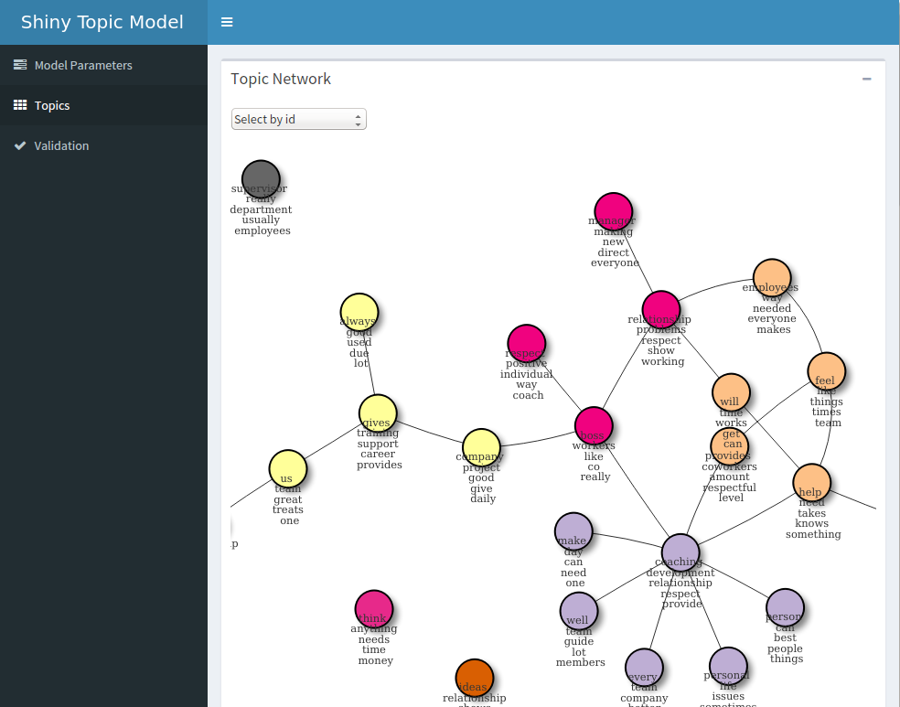
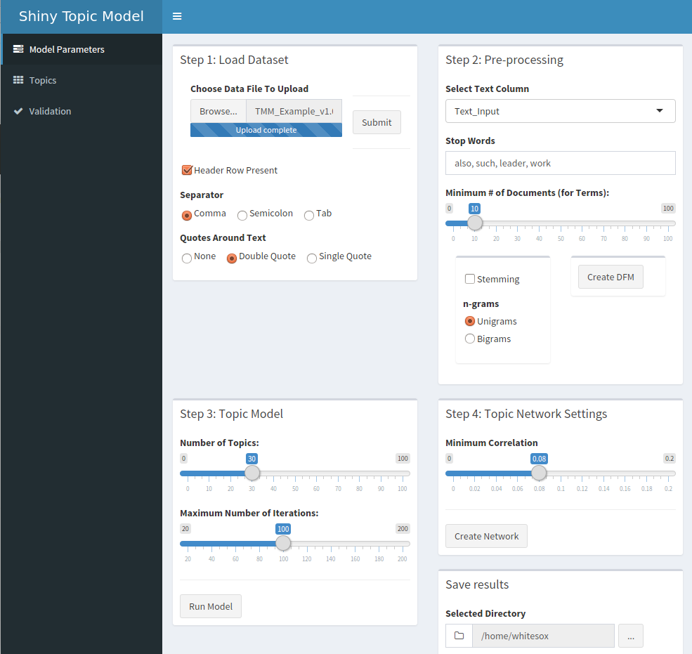
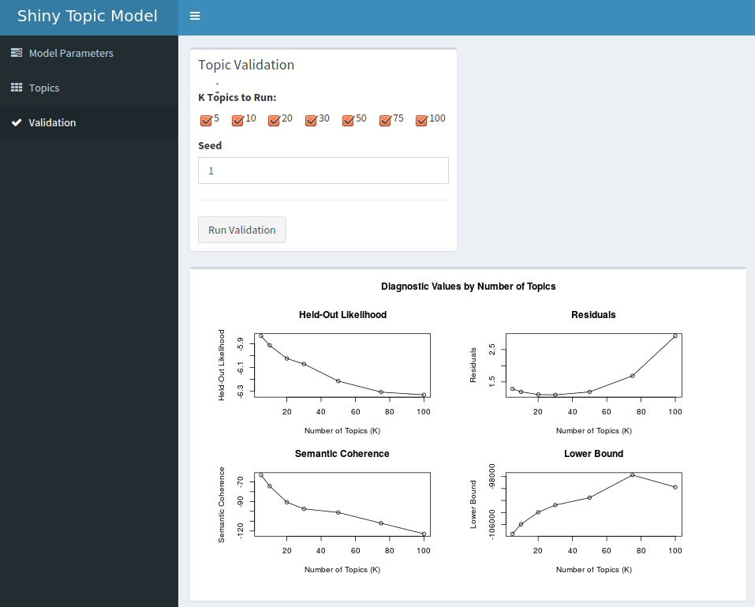

# topicApp: A Simple Shiny App for Topic Modeling

## Prerequisites for Windows users

Typically, R packages will automatically install dependent CRAN packages via the `install_github` function from `devtools`. However, for Windows (R >= 3.3.0), this function does not work.

Therefore, if you're running Windows, please run the following code to ensure you have the dependent packages before running the next step.

This may take a few minutes but you only need to run once.

```{r}
packages <- c("shiny","quanteda","shinydashboard","RColorBrewer","DT","visNetwork",
              "igraph","wordcloud","scatterD3","reshape","grid","tidyverse","shinyjs","shinyBS","stm")

install.packages(packages)
```

## Download and Running

To install and the run the app, open R/R Studio and run the following code:

```{r}
install.packages("devtools")
devtools::install_github("jbkunst/d3wordcloud") #non CRAN dependency
devtools::install_github("wesslen/topicApp")
topicApp::runApp()
```







## FAQ/Help

1.  I'm getting an error message when trying to install the `slam` package (a dependency for several other packages).

Try to run this command in your R (or R Studio) Console:

```{r}
slam_url <- "https://cran.r-project.org/src/contrib/Archive/slam/slam_0.1-37.tar.gz" 
devtools::install_url(slam_url)
```

This should manually install the `slam` package.

2.  I want to use more features of the `stm` packages (e.g., include covariates).

This app has been created for only simple analyses (e.g., small datasets, no covariates, limited functionality). If you're interested in more functionality of the `stm` package, you should considering either running the code individually or use Dan Zangri's `stmgui` package (see [stmGUI GitHub](https://github.com/dzangri/stmGUI))
